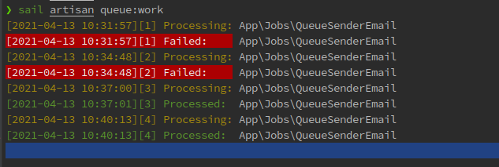
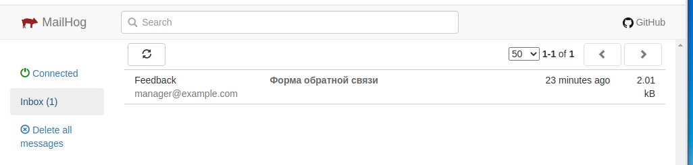
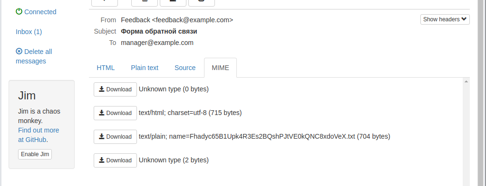
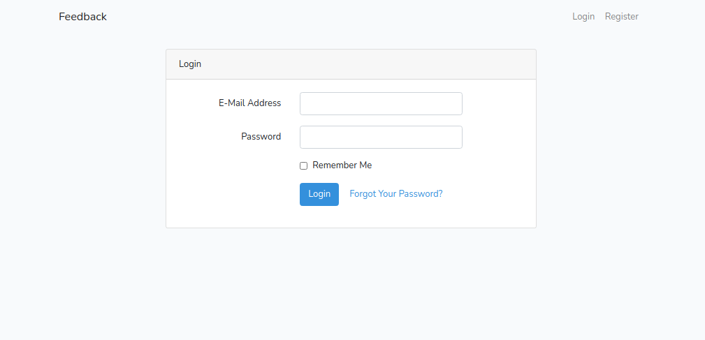
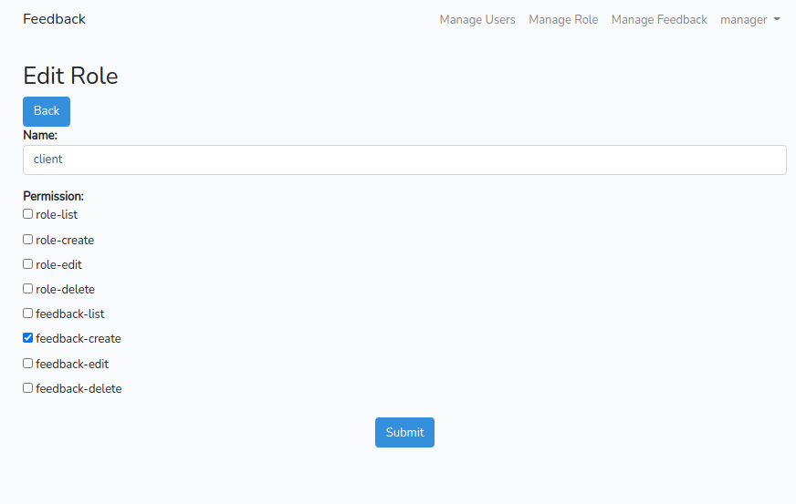

## Инструкция по развёртыванию проекта:
> "Тестовое задание для кандидата на вакансию Laravel разработчика".

Клонируем проект и переходим в папку с проестом

     git clone https://github.com/splaa/test-feedback-form.git && cd test-feedback-form

    cp .env.example .env
>Вы можете установить зависимости приложения, 
> перейдя в каталог приложения и выполнив 
> следующую команду. 
> Эта команда использует небольшой контейнер 
> Docker, содержащий PHP и Composer, 
> для установки зависимостей приложения:
 
    docker run --rm \
    -u "$(id -u):$(id -g)" \
    -v $(pwd):/opt \
    -w /opt \
    laravelsail/php80-composer:latest \
    composer install --ignore-platform-reqs

Собираем и запускаем контейнеры    
    
    sail build --no-cache
    sail up -d
Запускаем миграции с начальными данными

    sail artisan migrate --seed

Открываем проект в IDE
   
    pstorm test-feedback-form

Запускаем Queue 

    sail artisan queue:work    

>Failed: - Ошибка
> 
>Processed: - Выполнение успешно

Посмотреть отправленные email
http://0.0.0.0:8025/

скачать отправленный файл 

-регистрация\авторизация:
http://localhost/

      #Manager  
      e-mail:  manager@example.com
      password: manager

      #Client  
      e-mail:  client@example.com
      password: client

также можна редактировать создвать Роли и права 

[Команды применяемые в ходе тестового](progress_execution_test.md)
